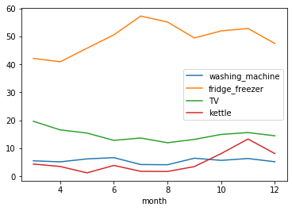

---
jupyter:
  jupytext:
    formats: ipynb,md
    text_representation:
      extension: .md
      format_name: markdown
      format_version: '1.2'
      jupytext_version: 1.4.0
  kernelspec:
    display_name: Python 3
    language: python
    name: python3
---

*by Guillaume Le Fur, Abderrahmane Lazraq and Leonardo Natale*


# Introduction: objectives and methodology


The objective of this project is to put the Machine Learning methods that we have been taught during the Machine Learning 2 course into practice, on a real data set, the "Smart meter is coming" challenge.

We will start by introducing our exploratory data analysis and what first conclusions we could draw from it. Then, we will detail the data pre-processing and feature engineering we've done, and justify their interest.

Finally, we will present the results we obtained using two methods : Deep learning (with RNNs and CNNs) and Boosting (with XGboost).

You will be able to find the entirety of the code on the following [GitHub repository](https://github.com/alazraq/AutoML). Not all the code will be detailed here but rather the most important parts.

The data is the following :


```python
# Loading the data and setting the time step as index
X_train = pd.read_csv(
    '../provided_data_and_metric/X_train_6GWGSxz.csv',
)
X_train.set_index("time_step", inplace=True)
X_train.index = pd.to_datetime(X_train.index)
Y_train = pd.read_csv(
    '../provided_data_and_metric/y_train_2G60rOL.csv',
)
Y_train.set_index("time_step", inplace=True)
Y_train.index = pd.to_datetime(Y_train.index)
```

```python
print(f'Shape of X_train: {X_train.shape}')
print(f'Shape of Y_train: {Y_train.shape}')
```

We initially have 9 predictors and 4 variables to predict. This data is a time series of electric consumption measures in one household, the goal is to find the part of that consumption dedicated to 4 appliances (washing machine, fridge_freezer, TV and kettle)


# Exploratory Data Analysis


## Missing values

Let us have a look at the missing values.

```python
X_train.isna().sum()
```

**Remarks:**

- We notice that the weather data is measured every hour, whereas the consumption data is measured every minute, so we have a lot of **sparsity from the weather data**. Depending on the algorithm, we will either try to impute these missing values (see `DataImputer` classes), or discard the weather data because we think it is not relevant.
- Regarding the consumption data, in order to see if the NaNs could be imputed or not, we tried to see if there were a lot of **consecutive NaNs**. The following table shows the number of NaNs that are consecutive, and that last for more than an hour.

```python
# Detecting consecutive missing data that last more than one hour
consecutive = X_train.consumption.isnull().astype(int) \
              .groupby(X_train.consumption.notnull()   \
              .astype(int).cumsum()).sum()
consecutive[consecutive > 60].sort_values()
```

We can also compute the percentage of missing values that are consecutive.

```python
cons1 = round(consecutive[consecutive > 1].sum()
              /X_train.consumption.isna().sum() * 100)
cons10 = round(consecutive[consecutive > 10].sum()
               /X_train.consumption.isna().sum() * 100)
cons60 = round(consecutive[consecutive > 60].sum()
               /X_train.consumption.isna().sum() * 100)
print(f'Percentage of consecutives (> 1 hour) : {cons60} \
        %\nPercentage of consecutive (> 10 min) : {cons10} \
        %\nTotal percentage for consecutives : {cons1} %')
```

Given this information, sometimes we have chosen to **discard** all the consecutive missing values that last more than one hour because imputation would have not have produced satisfactory results. Let us look at the missing values in the target Y_train to confirm this decision.

```python
Y_train.isna().sum()
```

Disarding the missing values safely in X_train is also encouraged by the fact that, **when there is a missing consumption in X_train, there is also a missing value in Y_train**. If we choose imputation, we also need to impute Y_train, which is a very risky operation.


## Global vs. per appliance consumption


First of all, if we denote by $\mathcal A$ the ensemble of appliances, $c_a$ the consumption of appliance $a \in \mathcal A$ and $c_{tot}$ the total consumption, it is important to emphasize the fact that, for each timestamp, we have: 

$$\sum_{a \in A} c_a \ne c_{tot}$$

We can clearly see this on the following plot:


But this plot is not precise enough. Instead, if we look at the daily moving average over 7 days, we have :


On the graph above, we can clearly see that **the overall consumption trend does not correspond to any per-appliance trend**. Indeed, we can observe two sharp declines (one around 2013-04-15, and another around 2013-08-10) that lead to an opposite effect on the per-appliance trends (on the first one, the per-appliance average drops, and on the second it raises). This makes it even harder to predict the per-appliance consumption as there is no clear link between them and the overall consumption.

The difference between the consumptions can most probably be explained by the **presence of other appliances in the house**.

This means that predicting the consumption of an appliance and its contribution to the total consumption is not the same problem.


Now let us have a look at some specificities of the data.


## Analysis of the predictors


The function add_features performs data augmentation for us to be able to perform a more insightful data exploration. The following features are added:

- **weekday, month and hour:** extracted from the time step
- **is_weekend and is_holidays:** to see if we can observe a different behaviour during weekends and holidays
- **is_breakfast, is_teatime and is_TVtime:** to see if we can spot the parts of the day when people tend to use specific appliances more

We also drop the weather data as it doesn't seem interesting for now.

```python
import holidays

def add_features(x):
    '''
    Performs data augmentation and drops unuseful features
    '''
    x = x.drop(
        ['Unnamed: 9', 'visibility', 'humidity', 'humidex', \
         'windchill', 'wind', 'pressure', 'temperature'],
        axis=1
    )
    fr_holidays = holidays.France()
    x["weekday"] = x.index.dayofweek
    x["month"] = x.index.month
    x["hour"] = x.index.hour
    x["is_weekend"] = (x["weekday"] > 4) * 1
    x["is_holidays"] = (x.index.to_series() \
                        .apply(lambda t: t in fr_holidays)) * 1
    x["is_breakfast"] = ((x.hour > 5) & (x.hour < 9)) * 1
    x["is_teatime"] = ((x.hour > 16) & (x.hour < 20)) * 1
    x["is_TVtime"] = ((x.hour > 17) & (x.hour < 23)) * 1
    x["is_night"] = ((x.hour > 0) & (x.hour < 7)) * 1
    return x

X_data_exploration = add_features(X_train)
```

**1. Weekend influence**

```python
X_data_exploration[["consumption", "is_weekend"]].groupby("is_weekend").mean()
```

The overall consumption is **higher during the weekend**, as expected.


**2. Difference between weekdays**


The consumption is also really **high on tuesday**. We could not find any justification for this.


**3. Difference between months**


The consumption is **higher during *cold months*** (October to February). This might be due to the **heating system** which works more in winter than in summer.


**4. Hourly consumption**


The hourly consumption is quite interesting. Indeed, we can see that most of the consumption takes place **after 4 p.m.**, which is after the end of *office hours*, when people are back home, and **before 11 p.m.**, when people go to sleep. There are also two smaller *peaks*, during **breakfast** and **lunch time**.


**5. Holidays influence**

```python
X_data_exploration[["consumption", "is_holidays"]].groupby("is_holidays").mean()
```

The consumption is **lower during the holidays**. Our analysis led us to believe that the data was coming from a **house located in France** because the data was fitting better the holidays in France than the ones in the UK or in the US.


## Analysis of the response variables


### Weekday influence per appliance


Let us look at the mean consumption for each appliance per weekday:

```python
Y_train.groupby(X_data_exploration.weekday).mean()
```

We can see that people tend to use their **washing machine more on Sundays**, which is logical because they have more time on Sundays and **electricity is cheaper**. Based on our assumption that the house is located in France, people most likely trying to take benefit from the *Heures Creuses* electricity rate.


### Month influence per appliance


Looking at the mean consumption for each appliance per month:





We detect a significant increase of the use of the **Kettle in November**, which also makes sense because it is one of the first 'cold' months so people start making tea again to warm themselves.


### Weekend influence per appliance

```python
Y_train.groupby(X_data_exploration.is_weekend).mean()
```

Once again, the use of the **washing machine on the weekend** is confirmed here. People tend to use their **kettle a bit more** as well. **We could have expected the consumption of the TV to be higher** on the weekend but it actually is not.


### Hour influence per appliance


From the plot above, we can extract the following information:
    
- People use their **TV in the morning**, really early, **and in the evening**, but not much after 11 p.m., after the main movie has finished.
- People use their **kettle around teatime**, which is quite logical, but also a bit in the morining, **for breakfast**.
- The consumption fo the **freezer does not vary much** during the day.
- People tend to turn their **washing machine on when they go to bed**, once again to reduce the **cost of electricity**.


### Holidays influence per appliance

```python
Y_train.groupby(X_data_exploration.is_holidays).mean()
```

**People do not use their washing machine on holidays, nor their kettle**. This makes sense because when people leave the house, the appliances that consume a lot of electricity when used are not used anymore so they stop consuming, while the appliances that consume an almost constant amount of electricity do not vary much because they keep working.


For all these reasons, we thought it would be relevant to **add some features to the data**, to be able to predict the per-appliance consumption with more accuracy. This will be detailed in section 4 of the report.


## Operating time of appliances


The goal here is to know how long each appliance is run on average in order to take this information into consideration when modelling.


### Kettle operating time


Usually, people do not use their Kettle for more than 5 minutes, the time for the water to boil. We want to check this. Below is a table showing for each duration the number of times the kettle was active for that duration.

```python
ket = Y_train.kettle.fillna(0).where(Y_train.kettle.fillna(0) < 2)
ket = ket.isnull().astype(int).groupby(ket.notnull().astype(int).cumsum()).sum()
ket = ket[ket > 0].sort_values(ascending = False)
ket.value_counts()
```

Indeed, most of the time, people use it for **1-3 minutes**. This use will be extremely hard to detect in the time series because it is really short.


### Washing machine operating time

```python
was = Y_train.washing_machine.fillna(0).where(Y_train.washing_machine.fillna(0) < 1)
was = was.isnull().astype(int).groupby(was.notnull().astype(int).cumsum()).sum()
was = was[was > 0].value_counts()
was[was > 5]
```

Here, we can see that the washing machine either works for **1-10 or 100-110 minutes**, which corresponds to a **washing machine cycle**.


### Fridge-freezer operating time

```python
fri = Y_train.fridge_freezer.fillna(0).where(Y_train.fridge_freezer.fillna(0) < 2)
fri = fri.isnull().astype(int).groupby(fri.notnull().astype(int).cumsum()).sum()
fri = fri[fri > 0].sort_values(ascending = False).value_counts()
fri[fri > 200]
```

For the fridge-freezer, we can see that, even though the energy consumption is quite constant, it is most of the time active for a period of around **20 minutes, which corresponds to the duration of a cooling cycle**. It also activates for **1-3 minutes**, which might correspond to the time **when people open the fridge's door**.

```python
tv = Y_train.TV.fillna(0).where(Y_train.TV.fillna(0) < 10)
tv = tv.isnull().astype(int).groupby(tv.notnull().astype(int).cumsum()).sum()
tv = tv[tv > 0].sort_values(ascending = False).value_counts()
tv[tv > 20]
```

Regarding the television, we can see that it is most of the time on for either a very short time (it appears that people like to watch TV during a time which is a multiple of 3), or one which is around 150 minutes, which is approximately **two hours and a half, which is the duration of a movie + the duration of the commercial breaks**.


# Data preprocessing


We define multiple pipelines for the input dataset in order to make the data compatible with the ML approach used:

- one pipeline for RNN
- one pipeline for CNN
- 4 pipelines for XGB, one per appliance

```python
class XPipeline:
    """Pipeline for the features of the input dataset"""
    def __init__(self):
        self.pipeline = Pipeline([
            # Step 1
            ('DataImputer', DataImputer()),
            
            # Step 2
            ('MyStandardScaler', MyStandardScaler()),
            
            # Step 3
            # FOR XGB
            ('DataAugmenter', DataAugmenter_TV()), # Different Data Augmenter per appliance
            
            # FOR RNN
            ('RNNDataAugmenter', RNNDataAugmenter()), # Same Data Augmenter for all 4 appliances
            ('MyOneHotEncoder', MyOneHotEncoder()),
            ('RNNDataFormatter', RNNDataFormatter())
            
            # FOR CNN 
            ('CNNDataFormatter', CNNDataFormatter())
        ])

    def fit(self, x):
        return self.pipeline.fit(x)

    def transform(self, x):
        return self.pipeline.transform(x)
    
class YPipeline:
    """
    Pipeline for the target of the input dataset of xgboost model
    """
    def __init__(self):
        self.pipeline = Pipeline([
            ('YImputer', YImputer()),
        ])

    def fit(self, x):
        return self.pipeline.fit(x)

    def transform(self, x):
        return self.pipeline.transform(x)
```

The YPipeline is the same for all ML approaches and includes a single step: an imputer that drops days where we have more than one successive hour of missing data as explained above, interpolate missing values linearly for the rest and sets the date as the index.


There are three steps in this pipeline:


- A **DataImputer** and **YImputer** that drop the unuseful columns, drop days where we have more than one successive hour of missing data as explained above, interpolate missing values linearly for the rest and sets the date as the index.

```python
class YImputer(BaseEstimator, TransformerMixin):  

    def __init__(self):
        self.X = None
        self.days_to_drop = [
            "2013-10-27", "2013-10-28", "2013-12-18", "2013-12-19",
            "2013-08-01", "2013-08-02", "2013-11-10", "2013-07-07",
            "2013-09-07", "2013-03-30", "2013-07-14"
        ]

    def fit(self, x, y=None):
        return self

    def transform(self, x, y=None):
        x.index = pd.to_datetime(x.index)
        try:
            x.drop(['Unnamed: 9', 'visibility', 'humidity', 
                    'humidex', 'windchill', 'wind', 'pressure'],
                   axis=1, inplace=True)
            for day in self.days_to_drop:
                x.drop(x.loc[day].index, inplace=True)
        except KeyError as e:
            pass

        x = x.interpolate(method='linear').fillna(method='bfill')
        return x
```

- A **standard scaler** that standardizes features by removing the mean and scaling to unit variance.

```python
class MyStandardScaler(BaseEstimator, TransformerMixin):  

    def __init__(self):
        self.scaler = StandardScaler()
    
    def fit(self, X, y=None):
        self.columns = X.columns
        self.scaler.fit(X)
        return self

    def transform(self, X, y=None):
        self.index = X.index
        X = pd.DataFrame(self.scaler.transform(X),
                         columns=self.columns, 
                         index=self.index
                        )
        return X
```

The third step is different depending on the ML approach considred:

- **For XGBoost:** A **data augmenter** for feature engineering. We implemented a different data augmenter for each appliance, we inspect those in detail in the following section.
- **For CNN:** A **CNN data formatter** to make the input data compatible with CNN.
- **For RNN:** An **RNN data augmenter** for feature engineering, a **One Hot Encoder** and an **RNN data formatter** to make the imput data compatible with RNN.

These are discussed further in the report.


# Feature engineering by appliance

For each appliance we produced additional features that aim at increasing the predictive power of the machine learning algorithms used by creating features from the raw data that help facilitate the machine learning process for that specific appliance. These follow from the data exploration in section II and include weekday, is_weekend and is_holidays which accounts for French national holidays.

For XGB regression, the most important features that we identified to transform the time series forecasting problem into a supervised learning problem are the lag features and the rolling mean. Here we focus on the different lags and rolling means used for each appliance, as well as other features specific to each appliance.


## Washing machine

```python
class DataAugmenter_Washing_Machine(BaseEstimator, TransformerMixin):

    def __init__(self):
        pass

    def fit(self, x, y=None):
        return self

    def transform(self, x, y=None):
        fr_holidays = holidays.France()
        x["weekday"] = x.index.dayofweek
        x["month"] = x.index.month
        x["hour"] = x.index.hour
        x["is_weekend"] = (x["weekday"] > 4) * 1
        x["is_holidays"] = (x.index.to_series().apply(lambda t: t in fr_holidays)) * 1

        x["is_night"] = ((x.hour > 0) & (x.hour < 7)) * 1
        
        x['lag_1'] = x['consumption'].shift(1)
        x['lag_5'] = x['consumption'].shift(5)
        x['lag_10'] = x['consumption'].shift(10)
        x['lag_20'] = x['consumption'].shift(20)
        x['lag_25'] = x['consumption'].shift(25)
        x['lag_30'] = x['consumption'].shift(30)
        x['lag_35'] = x['consumption'].shift(35)
        x['lag_40'] = x['consumption'].shift(40)

        x['lag_future_1'] = x['consumption'].shift(-1)
        x['lag_future_5'] = x['consumption'].shift(-5)
        x['lag_future_10'] = x['consumption'].shift(-10)
        x['lag_future_20'] = x['consumption'].shift(-20)
        x['lag_future_25'] = x['consumption'].shift(-25)
        x['lag_future_30'] = x['consumption'].shift(-30)
        x['lag_future_35'] = x['consumption'].shift(-35)
        x['lag_future_40'] = x['consumption'].shift(-40)

        x['rolling_mean_10'] = x['consumption'].rolling(window=10).mean()
        x['rolling_mean_20'] = x['consumption'].rolling(window=20).mean()
        x = x.ffill().bfill()
        
        return x
```

For the washing machine, we decided to add the feature **is_night** because people tend to operate the washing machine during the night as we saw in our EDA.

**Lags** of the consumption 40 min in the past and into the future as well as two **rolling means** one over a window of 10 min and the other over 20 min were added to account for a cycle of the washing machine.


## Fridge/ Freezer

```python
class DataAugmenter_Fridge_Freezer(BaseEstimator, TransformerMixin):

    def __init__(self):
        pass

    def fit(self, x, y=None):
        return self

    def transform(self, x, y=None):
        fr_holidays = holidays.France()
        x["weekday"] = x.index.dayofweek
        x["month"] = x.index.month
        x["hour"] = x.index.hour
        x["is_weekend"] = (x["weekday"] > 4) * 1
        x["is_holidays"] = (x.index.to_series().apply(lambda t: t in fr_holidays)) * 1
        
        x['lag_1'] = x['consumption'].shift(1)
        x['lag_5'] = x['consumption'].shift(5)
        x['lag_10'] = x['consumption'].shift(10)
        x['lag_20'] = x['consumption'].shift(20)

        x['lag_future_1'] = x['consumption'].shift(-1)
        x['lag_future_5'] = x['consumption'].shift(-5)
        x['lag_future_10'] = x['consumption'].shift(-10)
        x['lag_future_20'] = x['consumption'].shift(-20)

        x['rolling_mean_10'] = x['consumption'].rolling(window=10).mean()
        x['rolling_mean_20'] = x['consumption'].rolling(window=20).mean()
        x = x.ffill().bfill()
        
        return x
```

In the case of the fridge/ freezer, we decided to keep a **lags** of the consumption 20 min in the past and into the future which corresponds to the duration of a cooling cycle as explained in the EDA.

We also decided to add two **rolling means** one over a window of 10 min and the other over 20 min.


## TV

```python
class DataAugmenter_TV(BaseEstimator, TransformerMixin):

    def __init__(self):
        pass

    def fit(self, x, y=None):
        return self

    def transform(self, x, y=None):
        fr_holidays = holidays.France()
        x["weekday"] = x.index.dayofweek
        x["month"] = x.index.month
        x["hour"] = x.index.hour
        x["is_weekend"] = (x["weekday"] > 4) * 1
        x["is_holidays"] = (x.index.to_series().apply(lambda t: t in fr_holidays)) * 1

        x["is_TVtime"] = ((x.hour > 17) & (x.hour < 23)) * 1
        x["is_night"] = ((x.hour > 0) & (x.hour < 7)) * 1
        
        x['lag_1'] = x['consumption'].shift(1)
        x['lag_5'] = x['consumption'].shift(5)
        x['lag_10'] = x['consumption'].shift(10)
        x['lag_20'] = x['consumption'].shift(20)
        x['lag_25'] = x['consumption'].shift(25)
        x['lag_30'] = x['consumption'].shift(30)
        x['lag_35'] = x['consumption'].shift(35)
        x['lag_40'] = x['consumption'].shift(40)

        x['lag_future_1'] = x['consumption'].shift(-1)
        x['lag_future_5'] = x['consumption'].shift(-5)
        x['lag_future_10'] = x['consumption'].shift(-10)
        x['lag_future_20'] = x['consumption'].shift(-20)
        x['lag_future_25'] = x['consumption'].shift(-25)
        x['lag_future_30'] = x['consumption'].shift(-30)
        x['lag_future_35'] = x['consumption'].shift(-35)
        x['lag_future_40'] = x['consumption'].shift(-40)

        x['rolling_mean_10'] = x['consumption'].rolling(window=10).mean()
        x['rolling_mean_20'] = x['consumption'].rolling(window=20).mean()
        x = x.ffill().bfill()
        
        return x
```

For the TV, we add a feature **is_TVtime**, which indicates that the hour is between 5pm and 11pm; supposedly the time most people watch TV as explained in data exploration.


## Kettle

```python
class DataAugmenter_kettle(BaseEstimator, TransformerMixin):

    def __init__(self):
        pass

    def fit(self, x, y=None):
        return self

    def transform(self, x, y=None):
        fr_holidays = holidays.France()
        x["weekday"] = x.index.dayofweek
        x["month"] = x.index.month
        x["hour"] = x.index.hour
        x["is_weekend"] = (x["weekday"] > 4) * 1
        x["is_holidays"] = (x.index.to_series().apply(lambda t: t in fr_holidays)) * 1

        x["is_breakfast"] = ((x.hour > 5) & (x.hour < 9)) * 1
        x["is_teatime"] = ((x.hour > 16) & (x.hour < 20)) * 1
        
        x['lag_1'] = x['consumption'].shift(1)
        x['lag_2'] = x['consumption'].shift(2)
        x['lag_3'] = x['consumption'].shift(3)
        x['lag_4'] = x['consumption'].shift(4)
        x['lag_5'] = x['consumption'].shift(5)
        x['lag_10'] = x['consumption'].shift(10)
        x['lag_20'] = x['consumption'].shift(20)

        x['lag_future_1'] = x['consumption'].shift(-1)
        x['lag_future_2'] = x['consumption'].shift(-2)
        x['lag_future_3'] = x['consumption'].shift(-3)
        x['lag_future_4'] = x['consumption'].shift(-4)
        x['lag_future_5'] = x['consumption'].shift(-5)
        x['lag_future_10'] = x['consumption'].shift(-10)
        x['lag_future_20'] = x['consumption'].shift(-20)

        x['rolling_mean'] = x['consumption'].rolling(window=3).mean()
        x = x.ffill().bfill()
        
        return x
```

The kettle is a very special appliance because it only operates for few consecutive minutes as observed above, so we choose to keep a single rolling mean with a window of 3 min. 

We also add two features **is_breafast** (5 am to 9 am) and **is_teatime** (4 pm to 8 pm) which indicate the two time periods people use the kettle the most.


# Baseline: MultiOutputRegressor


In order to have an idea of what we could achieve with basic algorithms, our first thought was to try **Linear Regression**. 

By default, the LinearRegression of sklearn cannot predict multiple outputs. So, we used the `MultiOutputRegressor` from sklearn in order to wrap the linear regression. It acts as if it was fitting k differents linear regressions, one for each of the k variables to predict.

```python
# Prepare data for regression
di = XPipeline_XGB()
yi = YPipeline_XGB()
X_train = di.transform(X_train)
Y_train = yi.transform(Y_train)

# Split data into train and validation
x_train, x_valid, y_train, y_valid = train_test_split(
    X_train, Y_train, test_size=0.33, random_state=42)

# Define and fit Multioutput Linear Regressor
baseline_regressor = MultiOutputRegressor(LinearRegression())
baseline_regressor.fit(x_train, y_train)
```

# First approach: Recurrent Neural Networks


Our first approach, given that the data is time dependent, was to use Recurrent Neural Networks (RNNs), which are famous for their ability to work well on time series.
The hardest part of the work was to format the data correctly so that we could use it efficiently.


## Data formatting


The following code is responsible of the formatting of the data for the RNN. It takes an input of size `(n_obs, n_col)` and produces an output of size `(n_obs / batch_size, batch_size, n_col)`. We simply reformat the data by creating time series of size `batch_size`.

```python
class RNNDataFormatter(BaseEstimator, TransformerMixin):
    
    def __init__(self, batch_size=60):
        self.X = None
        self.batch_size = batch_size
    
    def fit(self, x, y=None):
        return self
    
    def transform(self, x, y=None):
        if isinstance(x, pd.DataFrame):
            x = x.to_numpy()
        print(x.shape)
        print(x.__class__.__name__)
        while x.shape[0] % self.batch_size != 0:
            print("Appending a row")
            print([x[-1, :]])
            x = np.append(x, [x[-1, :]], axis=0)
        print(x.shape)
        nb_col = x.shape[1]
        return x.reshape((int(x.shape[0] / self.batch_size), self.batch_size, nb_col))
```

## Data augmentation - encoding

As the RNN will be working on all the variables to predict, we only use one `DataAugmenter`, which adds the same features as previously discussed.

```python
class RNNDataAugmenter(BaseEstimator, TransformerMixin):
    
    def __init__(self):
        pass

    def fit(self, x, y=None):
        return self

    def transform(self, x, y=None):
        fr_holidays = holidays.France()
        x["weekday"] = x.index.dayofweek
        x["month"] = x.index.month
        x["hour"] = x.index.hour
        x["is_weekend"] = (x["weekday"] > 4) * 1
        x["is_holidays"] = (x.index.to_series().apply(lambda t: t in fr_holidays)) * 1

        x["is_breakfast"] = ((x.hour > 5) & (x.hour < 9)) * 1
        x["is_teatime"] = ((x.hour > 16) & (x.hour < 20)) * 1
        x["is_TVtime"] = ((x.hour > 17) & (x.hour < 23)) * 1
        x["is_night"] = ((x.hour > 0) & (x.hour < 7)) * 1
        return x
```

We also use a custom One Hot Encoder for the categorical features (hours, weekdays and months). The encoder had to be customized to prevent an error if there are different values between X_train and X_test (if X_test has months that are not present in X_train for instance).

```python
class MyOneHotEncoder(BaseEstimator, TransformerMixin):

    def __init__(self):
        self.all_possible_hours = np.arange(0, 24)
        self.all_possible_weekdays = np.arange(0, 7)
        self.all_possible_months = np.arange(1, 13)
        self.ohe_hours = OneHotEncoder(drop="first")
        self.ohe_weekdays = OneHotEncoder(drop="first")
        self.ohe_months = OneHotEncoder(drop="first")
    
    def fit(self, X, y=None):
        self.ohe_hours.fit(self.all_possible_hours.reshape(-1,1))
        self.ohe_weekdays.fit(self.all_possible_weekdays.reshape(-1,1))
        self.ohe_months.fit(self.all_possible_months.reshape(-1,1))
        return self

    def transform(self, X, y=None):
        hours = pd.DataFrame(self.ohe_hours.transform(X.hour.values.reshape(-1,1)).toarray(), 
                             columns=["hour_"+str(i) for i in range(1, 24)],
                             index=X.index
                            )
        weekdays = pd.DataFrame(self.ohe_weekdays.transform(X.weekday.values.reshape(-1,1)).toarray(),
                                columns=["weekday_"+str(i) for i in range(1, 7)],
                                index=X.index
                               )
        months = pd.DataFrame(self.ohe_months.transform(X.month.values.reshape(-1,1)).toarray(), 
                              columns=["month_"+str(i) for i in range(2, 13)],
                              index=X.index
                             )
        X = pd.concat([X, hours, weekdays, months], axis=1)
        X.drop(["month", "weekday", "hour"], axis=1, inplace=True)
        return X
```

## Preprocessing Pipeline

```python
class XPipeline_RNN:
    """Pipeline for the features of input dataset of RNN"""
    def __init__(self):
        self.pipeline = Pipeline([
            # Imputing the data
            ('DataImputer', DataImputer()),
            # Scaling it
            ('MyStandardScaler', MyStandardScaler()),
            # Adding features
            ('RNNDataAugmenter', DataAugmenter()), 
            # Encoding features
            ('MyOneHotEncoder', MyOneHotEncoder()), 
            # Formatting the data correctly
            ('RNNDataFormatter', RNNDataFormatter()) 
    ])

    def fit(self, x):
        return self.pipeline.fit(x)

    def transform(self, x):
        return self.pipeline.transform(x)
    
class YPipeline_RNN:
    """Pipeline for target of input dataset of RNN"""
    def __init__(self):
        self.pipeline = Pipeline([
            # Imputing the data
            ('YImputer', YImputer()), 
            # Formatting the data correctly
            ('RNNDataFormatter', RNNDataFormatter()) 
        ])

    def fit(self, x):
        return self.pipeline.fit(x)

    def transform(self, x):
        return self.pipeline.transform(x)
```

We apply several transformations to X :

- The missing data is imputed.
- It is scaled.
- Features are added.
- Categorical features are One Hot Encoded.
- Data is formatted to fit the input of the RNN.

Regarding Y, only formatting and imputing missing data are done.


## Architecture

Our architecture is the following :

- One LSTM layer with 20 units.
- One Dense layer with 4 units (corresponding to the 4 variables to predict)
- A ReLU activation function.
- Adam optimizer
- Early stopping, with a patience of 2.


## Custom loss

In the very beginning, we were using the RMSE as a loss to fit our models. But, as the quality of the model is assessed using a metric which is specific to this project, we though it would be interesting to use the custom metric during the training phase. In order to do so, we had to adapt the code of the provided metric to make it compatible with `tensorflow`.

```python
import tensorflow as tf

@tf.function
def metric_nilm(self, y_true, y_pred):
    y_pred = tf.reshape(y_pred, [tf.shape(y_pred)[0] * tf.shape(y_pred)[1], tf.shape(y_pred)[2]])
    y_true = tf.reshape(y_true, [tf.shape(y_true)[0] * tf.shape(y_true)[1], tf.shape(y_true)[2]])
    score = 0.0

    test = tf.slice(y_true, [0, 0], [-1, 1])
    pred = tf.slice(y_pred, [0, 0], [-1, 1])
    score += mt.sqrt(mt.reduce_sum(mt.subtract(pred, test) ** 2) / float(len(test))) * 5.55

    test = tf.slice(y_true, [0, 1], [-1, 1])
    pred = tf.slice(y_pred, [0, 1], [-1, 1])
    score += mt.sqrt(mt.reduce_sum(mt.subtract(pred, test) ** 2) / float(len(test))) * 49.79

    test = tf.slice(y_true, [0, 2], [-1, 1])
    pred = tf.slice(y_pred, [0, 2], [-1, 1])
    score += mt.sqrt(mt.reduce_sum(mt.subtract(pred, test) ** 2) / float(len(test))) * 14.57

    test = tf.slice(y_true, [0, 3], [-1, 1])
    pred = tf.slice(y_pred, [0, 3], [-1, 1])
    score += mt.sqrt(mt.reduce_sum(mt.subtract(pred, test) ** 2) / float(len(test))) * 4.95

    score /= 74.86

    return score
```

Using this function, we were able to optimize the neural network for our specific problem rather than only minimizing the mean squared error.


# Second approach: Convolutional Neural Networks


The idea to use CNN came up after we asked ourselves the following question:  
"*How can we develop a model which takes into account present and future values of consumption, centered around the current time step?*"  


## Data Formatting

Our answer, was to structure the data as follows. Let's take a simple example, with just consumption and TV.    
  
The data is originally in this format:

| Cons. | TV     |
|-------|--------|
| 10    | 0      |       
| 20    | 8      |
| 25    | 10     |  
| 18    | 8      |       
| 12    | 0      |
| 5     | 0      |  

After it goes through our pipeline, it would come out in this format:

| Cons.            | TV     |
|------------------|--------|
| **15**, 10, 20,  | 0      |       
| 10, 20, 25       | 8      |
| 20, 25, 18       | 10     |  
| 25, 18, 12       | 8      |       
| 18, 12, 5        | 0      |
| 12, 5, **15**    | 0      |

where the data is left and right padded with the mean value for consumption **15**, in order to center the sequence around the present value.  
We have then divided the sequence into multiple input/output patterns, where `batch_size` time steps are used as input and one time step is used as output.


The class `CNNDataFormatter` takes care of this:

```python
class CNNDataFormatter(BaseEstimator, TransformerMixin):
    
    def __init__(self, batch_size=120):
        self.X = None
        self.batch_size = batch_size
    
    def fit(self, x, y=None):
        return self
    
    def transform(self, x, y=None):
        
        xx = np.zeros((x.shape[0], self.batch_size, 1))
        x = np.pad(x, ((self.batch_size//2, self.batch_size//2), (0,0)), 'mean')
        for i in range(len(xx)):
            try:
                xx[i, :, :] = x[i:self.batch_size+i, :]
            except:
                print(i)
        return xx
```

The output will be of the size `(401759, 120, 1)`.


## Preprocessing Pipeline


First, the class `DataImputer` takes care of missing values and drops all columns but consumption.  
Then the data is passed to a `Standard Scaler`, before being formatted as explained above.

```python
class XPipeline_CNN:

    def __init__(self):
        self.pipeline = Pipeline([
                ('DataImputer', DataImputer()),
                ('StandardScaler', StandardScaler()),
                ('CNNDataFormatter', RNNDataFormatter())
        ])

    def fit(self, x):
        return self.pipeline.fit(x)

    def transform(self, x):
        return self.pipeline.transform(x)
```

Regarding the target variable, we take care only of the missing values with `YImputer` and do not apply any transformation.


## Architecture

Our architecture is inspired from the one adopted in our deep learning course **MAP545** and is as follows:

- 1D convolution with valid padding, 32 filters, 6 kernel size
- ReLU activation
- 1D convolution with valid padding, 32 filters, 3 kernel size
- ReLU activation
- 1D convolution with valid padding, 48 filters, 3 kernel size
- ReLU activation
- 1D convolution with valid padding, 64 filters, 3 kernel size
- ReLU activation
- 1D convolution with valid padding, 64 filters, 2 kernel size
- ReLU activation
- Flatten
- Dense layer with 1024 nodes, ReLu activation
- Dense layer with 1 nodes, linear activation


Four different models, one per appliance, are fit using the efficient Adam version of stochastic gradient descent and optimized using the mean squared error loss function. Given we train four different models, minimizing the mean squared error is analogous to minimizing the metric nilm per single appliance.

```python
model.compile(loss=keras.losses.mean_squared_error, 
              optimizer=tf.keras.optimizers.Adam())
history = model.fit(x_train, y_train, epochs=4,
                    validation_data=(x_valid, y_valid))
```

Promising results were obtained for **TV**, **fridge_freezer** and **washing_machine**.  
However, the model fails to predict consumption for **kettle** due to the high sparsity of the data.  
**Going further**, more accurate results could be obtained by incorporating other features such as weather data in our model.


All the code is found in the `/CNN` folder in our repository.


# Third approach : ensemble methods - Boosting


For our third attempt, we tried fitting four different regressors - one for each appliance. The goal is to see if we can outperform deep learning methods for some of the appliances, especially kettle for which CNN does not give good results, using classical machine learning methods.

We chose **XGBoost** which has been used to win many data challenges, outperforming several other well-known implementations of gradient tree boosting.


## Preprocessing Pipelines
For each appliance, we preprocess the data using the pipeline defined in section 3. The only difference between the pipelines of each appliance are the data augmenters:

- **Lag features and the rolling means** are used in all augmenters to transform the time series forecasting problem into a supervised learning problem. Different lags and rolling means have been used for each appliance according to its specifities.
- **Other features specific to each appliance** are added like is_TVtime, is_night, is_breakfast and is_teatime

Please refer to the section on feature engineering for more details about this part. We give the pipeline for TV as an example, pipelines for the other appliances are defined in a similar fashion using the corresponding data augmenter defined above

```python
class XPipeline_TV:
    def __init__(self):
        self.pipeline = Pipeline([
            ('DataImputer', DataImputer()),
            ('MyStandardScaler', MyStandardScaler()),
            ('DataAugmenter_TV', DataAugmenter()),
        ])
    def fit(self, x):
        return self.pipeline.fit(x)
    def transform(self, x):
        return self.pipeline.transform(x)
```

## Custom metric per appliance
In order to be able to fit a different regressor for each appliance, we had to define a custom metric inspired from the metric provided, where we only keep the score corresponding to the specific appliance we are considering.

```python
# Custom nilm metric in case of fridge for example
def nilm_metric(y_true, y_pred):
        score = math.sqrt(sum((y_pred.get_label() - y_true) ** 2) / len(y_true)) * 49.79
        score /= 74.86
        return "nilm", score
```

## Model Definition and Fitting
We fit 4 different regressors, one for each appliance, using the custom nilm_metric defined above.

```python
import xgboost as xgb

# Fitting an XGBoost regressor
xgb_reg = xgb.XGBRegressor(max_depth=10, learning_rate=0.1, n_estimators=100, random_state=42)
xgb_reg.fit(x_train, y_train,
            eval_set=[(x_val, y_val)],
            eval_metric=nilm_metric,
           )
```

<!-- #region -->
### Feature Importance


Let's look at the most important features identifird by XGB for kettle for example:

Feature ranking:
1. is_breakfast (0.144821)
2. lag_10 (0.131271)
3. consumption (0.120324)
4. lag_future_2 (0.100311)
5. lag_future_1 (0.035501)
6. hour_mean (0.035224)
7. lag_3 (0.034047)
8. lag_2 (0.033974)
9. lag_future_5 (0.032470)
10. rolling_mean_-5 (0.030139)
11. lag_future_4 (0.029670)
12. lag_future_3 (0.028952)
13. lag_20 (0.028152)
14. lag_1 (0.027947)
15. lag_5 (0.026906)
<!-- #endregion -->


From the features importance graph, we can clearly see that four features seem to be way more important than the others among which: is_breakfast as expected since it indicates when people use kettle the most, consumption and two lag variables.


We can see on the graph above that the appliance responsible for the **sharpest variations is the kettle**. Indeed, it is turned on for a very short time but consumes a lot of electricity, so these variations are extremely hard to learn and detect with a CNN. This is the main reason why we want to try **Extreme Gradient Boosting** in order to detect more subtle changes in the consumption.


**XGB Result:** We were able to achieve a better prediction for kettle using XGB. But CNN provided better results for the other appliances.


# Results and benchmark - Conclusion


## Results


In this part, the results of all the methods we tried is summarised. At the very beginning, we tried the **Linear Regression** as a baseline. Our score was similar to the benchmark on the website. Afterwards, we started working on **Recurrent Neural Networks**. Setting them up was very time consuming as we lacked some experience in the field. The results were not really satisfactory as we did not manage to make them perform betten than the Linear Regression.
Then, we started working on **XGBoost** and **Convolutional Neural Networks** at the same time. Both were giving good results but some were performing better on some appliances than others. So we tried to **bag** them in order to maximize the accuracy. Once we had used the best tool for every appliance, we started **tuning** the models individually, which led to our best model.

```python
import matplotlib.dates as mdates

res = pd.read_csv(
    'scores.csv',
    index_col=False
)

res = res.set_index('Ranking').round(4)[['Method', 'Date', 'Public score']]
res
```

```python
res.columns = ['method', 'date', 'score']
res.date = pd.to_datetime(res.date)

benchmark_value = 47.6480

plt.figure(figsize=(15, 8))
plt.plot_date(
    res.date,
    res.score,
    linestyle='--'
)

for index, row in res.iterrows():
    x = row['date']
    y = row['score']
    label = row['method']
    plt.annotate(label, (mdates.date2num(x), y))

plt.annotate("Benchmark", (mdates.date2num(res.date[0]), benchmark_value - .5))
plt.axhline(y=benchmark_value, c="red")
plt.show()
```

## Conclusion


This project was interesting and challenging on multiple aspects. It was the first time we had to deal with time series, which was a real challenge because it is a whole new paradigm: the data is now linked by their order and not only by the values of the variables.  
We have also applied RNNs for the first time. They are complex to understand and require meticulous tuning in order to give satisfactory results. Data formatting and preparation is also a big part of the work on RNNs.

Moreover, we have understood the interest of mixing models when there are multiple variables to predict, so that one can optimize the prediction for every variable.
The sparsity required much attention too, and we would have liked to dedicate more time to its study.


PS: submissions on the platform were made under two user names `guillaume.le-fur & LeonardoNatale` and `Abdou.Lazraq`.


# References


- Kelly, Jack & Knottenbelt, William. (2015). _Neural NILM: Deep Neural Networks Applied to Energy Disaggregation._ 10.1145/2821650.2821672. 
- Brownlee, Jason. (2018). _How to Develop Convolutional Neural Network Models for Time Series Forecasting._ http://bit.ly/CNN_TimeSeries [last visited: 22/03/20]
- Géron, Aurélien. (2019). _Hands-On Machine Learning with Scikit-Learn, Keras & TensorFlow._ O'Reilly.
